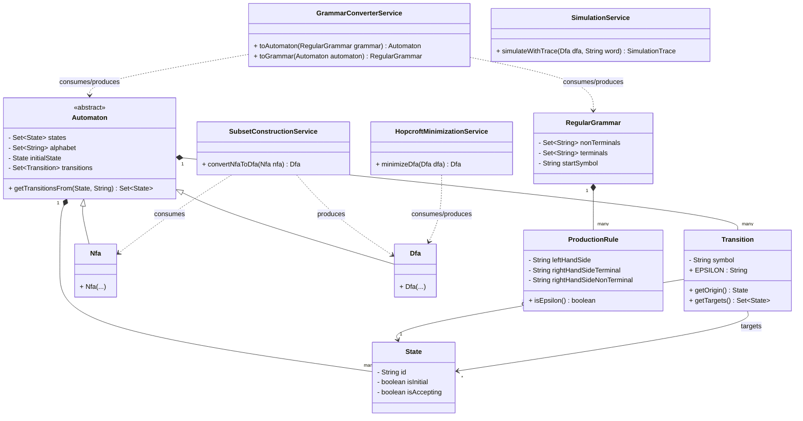
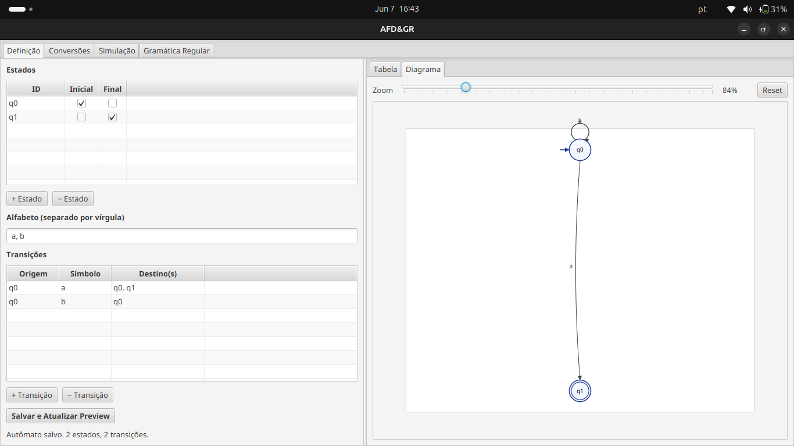
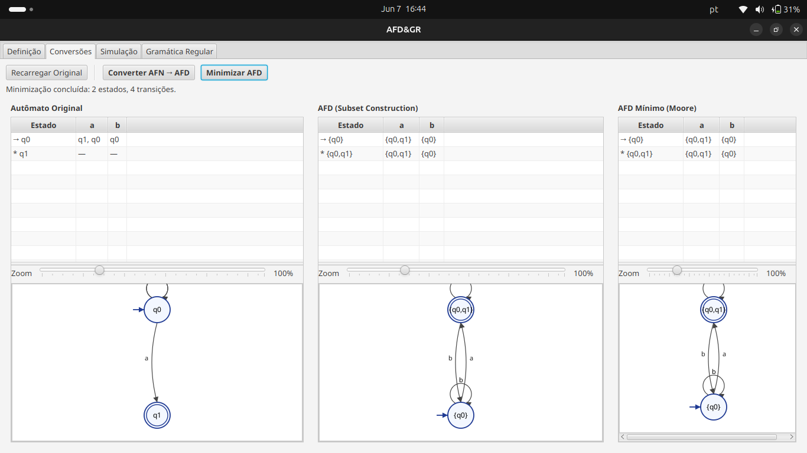
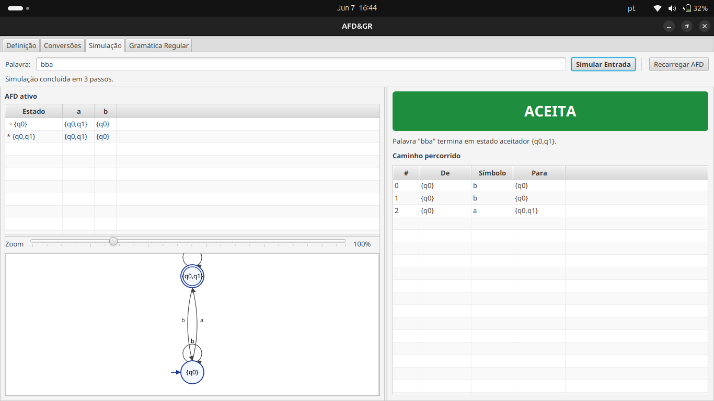
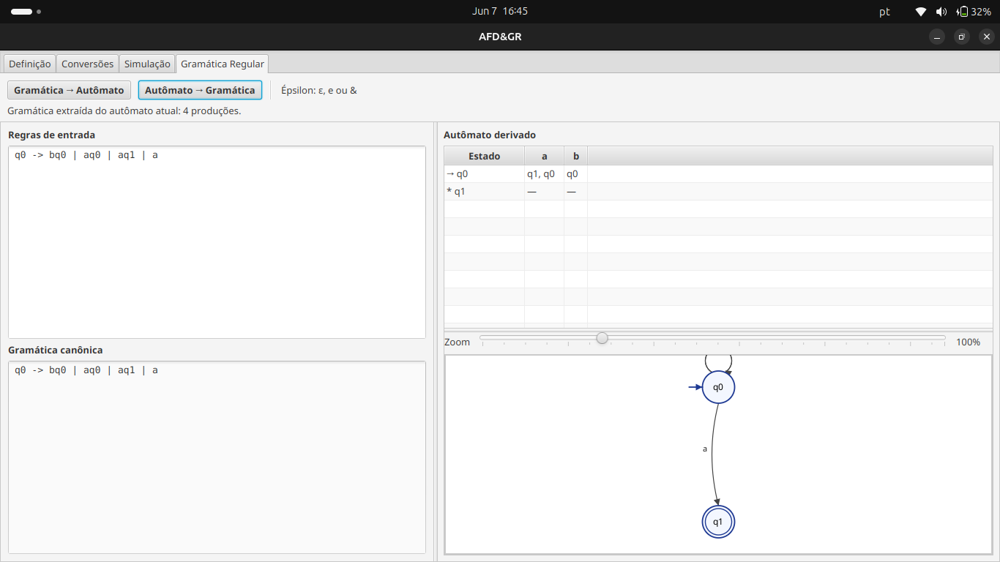

# Documentação do Projeto: Simulador de Teoria da Computação (SIN 141)

## 1. Introdução e Objetivo

O presente projeto tem como objetivo a implementação de um sistema para a manipulação de Autômatos Finitos e Gramáticas Regulares, abordando conceitos fundamentais da Teoria da Computação. O escopo contempla as seguintes operações algorítmicas, todas implementadas do zero sem auxílio de bibliotecas externas de processamento de linguagens formais:

*   Modelagem de Autômatos Finitos Não-Determinísticos (AFN) com transições vazias (ε).
*   Conversão de AFN para Autômato Finito Determinístico (AFD) via algoritmo de Construção de Subconjuntos.
*   Minimização de AFDs utilizando o algoritmo clássico de particionamento (Moore/Hopcroft).
*   Simulação e validação do reconhecimento de palavras por um AFD.
*   Conversões bidirecionais entre Autômatos Finitos (AF) e Gramáticas Regulares (GR).

## 2. Tecnologias Escolhidas

Para assegurar os requisitos de robustez, portabilidade e uma interface gráfica amigável, as seguintes tecnologias foram empregadas:

*   **Linguagem de Programação:** Java (JDK 21)
    *   **Justificativa:** Linguagem fortemente tipada, excelente para modelagem de domínio complexa, orientada a objetos e amplamente suportada.
*   **Interface Gráfica (GUI):** JavaFX 21
    *   **Justificativa:** Framework moderno para construção de interfaces ricas em Java. A separação entre a visão (`.fxml`) e a lógica de apresentação (`Controller`) facilita a manutenção.
*   **Gerenciador de Dependências e Build:** Apache Maven
    *   **Justificativa:** Padroniza a compilação, execução de testes e empacotamento do projeto.
*   **Testes Automatizados:** JUnit 5
    *   **Justificativa:** Framework padrão na indústria para testes unitários em Java, garantindo a corretude dos algoritmos do domínio.

## 3. Estrutura e Arquitetura do Projeto

O projeto foi estruturado utilizando o padrão de **Arquitetura em Camadas (Layered Architecture)**, focado no desacoplamento rigoroso. A lógica de negócio e matemática ("Core Algorítmico") não possui qualquer conhecimento sobre a interface gráfica.

A divisão de pacotes (`br.ufv.sin141`) reflete essa separação:

### 3.1. `domain.model` (Domínio Puro)
Contém as entidades matemáticas imutáveis e puras que representam os conceitos teóricos:
*   `State`, `Transition`, `Automaton` (Abstrata), `Nfa`, `Dfa`
*   `ProductionRule`, `RegularGrammar`

### 3.2. `domain.service` (Serviços e Algoritmos)
Abriga as regras de negócio complexas. São classes "Stateless" (sem estado) que recebem estruturas de domínio e retornam novas estruturas.
*   `SubsetConstructionService`: Converte AFN em AFD.
*   `HopcroftMinimizationService`: Minimiza AFDs.
*   `GrammarConverterService`: Realiza as conversões GR ↔ AF.
*   `SimulationService`: Executa a travessia no autômato para validação de palavras.

### 3.3. `application` (Aplicação e Orquestração)
Atua como um Facade/Controlador central que traduz o domínio abstrato para estruturas fáceis de serem consumidas pela interface.
*   `TheoryAppController`: Orquestra as chamadas aos serviços e mantém o estado da sessão (Autômato atual, Gramática atual).
*   `dto`: Objetos de transferência simples para tabelas e histórico de execução (`SimulationStep`, `TransitionTableRow`).
*   `exception`: Exceções de negócio de runtime (`AlphabetViolationException`, `MalformedGrammarException`).

### 3.4. `presentation` (Interface Gráfica)
Camada visual construída com JavaFX.
*   Telas `.fxml` definindo o layout.
*   Controllers visuais (`MainViewController`, `AutomatonDefinitionController`, etc.) que repassam as ações dos botões para o `TheoryAppController`.
*   Painéis customizados para desenho gráfico (`AutomatonGraphView`).

---

## 4. Diagrama UML (Classes Principais)

Abaixo é apresentado um diagrama de classes simplificado evidenciando a modelagem do Domínio e dos Serviços.

---

## 5. Telas do Sistema (Mockups / Espaços para Capturas)

A interface gráfica foi dividida em abas (Tabs) para separar as lógicas.

*(Nota: Insira as capturas de tela do seu sistema rodando abaixo de cada descrição)*

### 5.1. Tela Principal: Definição de Autômato (AFN/AFD)
Esta aba permite ao usuário definir o autômato original. Contém as tabelas para entrada de estados, definição de alfabeto e a grade de transições.

### 5.2. Aba de Conversões e Minimização
Painel dedicado para visualização do AFN e conversão para AFD (via botão de ação). Também possui a funcionalidade para minimizar o AFD resultante, exibindo um comparativo visual em tabelas e gráficos.

### 5.3. Aba de Simulação
Tela onde o usuário pode testar palavras no autômato ativo. Apresenta um input de texto, um botão de "Simular" e uma visualização em formato de log/trace demonstrando o passo a passo da leitura dos símbolos e o resultado final (ACEITO / REJEITADO).

### 5.4. Aba de Gramática Regular
Interface para entrada textual de regras gramaticais (ex: `S -> aA | bB | ε`). Possui botões que acionam os serviços de conversão mútua (`GR -> AF` e `AF -> GR`), exibindo o resultado formatado.

---
